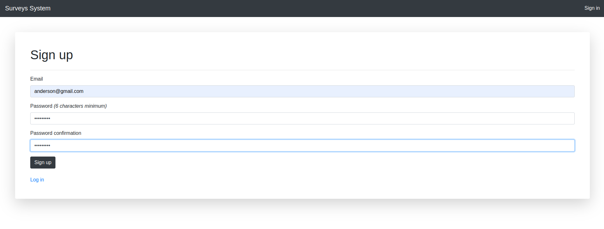
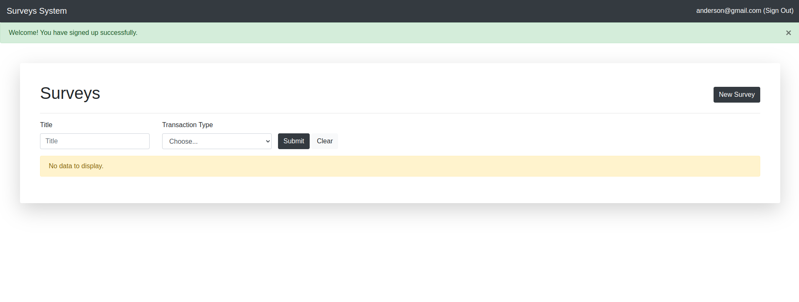
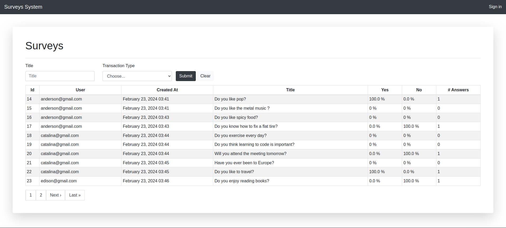
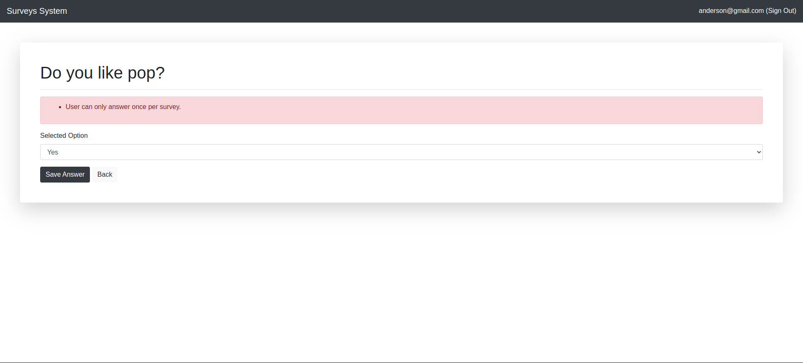
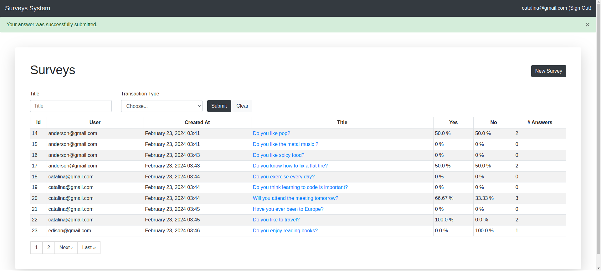
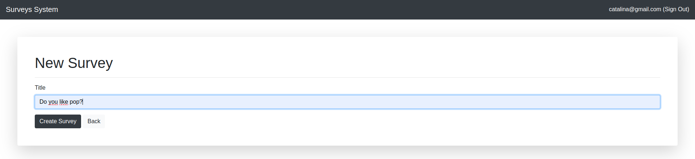

# Simple Survey Tool

## Description

This application is a simple survey tool developed with Ruby on Rails. It allows users to create surveys with a single yes/no answer question. Surveys can be answered multiple times, and the app tracks the responses, displaying the results on the home screen with the percentage of yes and no answers.

## Features

- Creation of an unlimited number of surveys.
- Each survey consists of one question with a yes/no answer.
- List of surveys available on the home screen with a button to create new ones.
- Surveys can be answered multiple times with yes/no responses.
- Tracking of when each survey response is saved.
- Display of survey results on the home screen.

## Technologies Used

- Ruby 3.2
- Rails 7.1.2
- SQLite3
- Bootstrap for styling

## Installation

To run this application in your local development environment, follow these steps:

1. Clone this repository to your local machine or get a copy of the app.
2. Navigate to the project directory in your terminal.
3. Run `bundle install` to install the dependencies.
4. Run `rails db:migrate` to create the database and apply migrations.
5. Start the Rails server with `rails server`.
6. Open your browser and navigate to `http://localhost:3000` to access the application.

## Running Tests

This application uses RSpec for testing. To run all tests, follow these steps:

1. Ensure you are in the root directory of the application.
2. Open your terminal.
3. Run the test suite with the following command:

```bash
RAILS_ENV=test && bundle exec rspec
```

## Examples













## Author Information

- **Name**: Anderson Alvarez Vásquez
- **Email**: andersonav91@gmail.com

For any inquiries or improvements, feel free to contact me.

